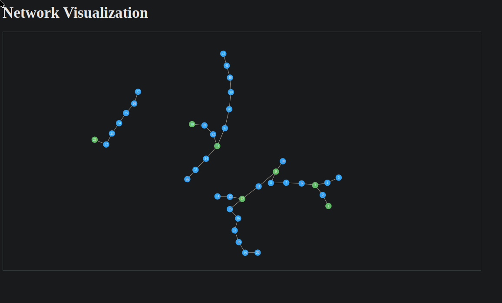

# d3 visualization of node network structure

## Creating graph
Define a dictionary of lists, where the key is the name of a node

``` js

  const networkData = {
    1: [2, 3, 4, 5],
    3: [6, 7, 8, 9, 10],
    9: [11, 12, 13, 14],
    12: [15, 16, 17, 18, 19, 20],
    21: [22, 23, 24, 25, 26, 27],
    30: [31, 32, 33, 34, 35, 36],
    33: [37, 38, 39, 40, 41, 42],
  };
```

## Implementation features
- auto generate network randomly, given num nodes, num containers and probabilities
- auto generate tags from given probabilities
- connect notes with tags to tag node
- loose/singleton node connections to other nodes
- external source nodes
- connections from disconnected components
- include distance proximity to specific nodes
- collapse component into just index nodes, including the properties of all contained nodes, collapse whole component into a single index `component` is graph terminology for disconnected graph

## Developing

Once you've created a project and installed dependencies with `npm install` (or `pnpm install` or `yarn`), start a development server:

```bash
npm run dev

# or start the server and open the app in a new browser tab
npm run dev -- --open
```

## Building

To create a production version of your app:

```bash
npm run build
```

You can preview the production build with `npm run preview`.

> To deploy your app, you may need to install an [adapter](https://kit.svelte.dev/docs/adapters) for your target environment.
